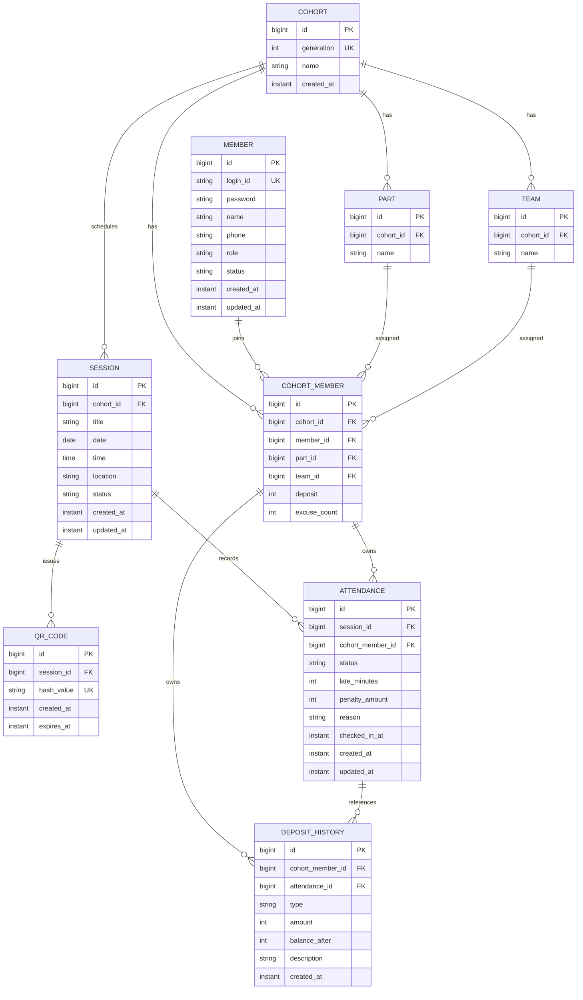

# ERD

```mermaid
erDiagram
    MEMBER {
        bigint id PK
        string login_id UK
        string password
        string name
        string phone
        string role
        string status
        instant created_at
        instant updated_at
    }

    COHORT {
        bigint id PK
        int generation UK
        string name
        instant created_at
    }

    PART {
        bigint id PK
        bigint cohort_id FK
        string name
    }

    TEAM {
        bigint id PK
        bigint cohort_id FK
        string name
    }

    COHORT_MEMBER {
        bigint id PK
        bigint cohort_id FK
        bigint member_id FK
        bigint part_id FK
        bigint team_id FK
        int deposit
        int excuse_count
    }

    SESSION {
        bigint id PK
        bigint cohort_id FK
        string title
        date date
        time time
        string location
        string status
        instant created_at
        instant updated_at
    }

    QR_CODE {
        bigint id PK
        bigint session_id FK
        string hash_value UK
        instant created_at
        instant expires_at
    }

    ATTENDANCE {
        bigint id PK
        bigint session_id FK
        bigint cohort_member_id FK
        string status
        int late_minutes
        int penalty_amount
        string reason
        instant checked_in_at
        instant created_at
        instant updated_at
    }

    DEPOSIT_HISTORY {
        bigint id PK
        bigint cohort_member_id FK
        bigint attendance_id FK
        string type
        int amount
        int balance_after
        string description
        instant created_at
    }

    COHORT ||--o{ PART : has
    COHORT ||--o{ TEAM : has
    COHORT ||--o{ COHORT_MEMBER : has
    MEMBER ||--o{ COHORT_MEMBER : joins
    PART ||--o{ COHORT_MEMBER : assigned
    TEAM ||--o{ COHORT_MEMBER : assigned
    COHORT ||--o{ SESSION : schedules
    SESSION ||--o{ QR_CODE : issues
    SESSION ||--o{ ATTENDANCE : records
    COHORT_MEMBER ||--o{ ATTENDANCE : owns
    COHORT_MEMBER ||--o{ DEPOSIT_HISTORY : owns
    ATTENDANCE ||--o{ DEPOSIT_HISTORY : references
```
