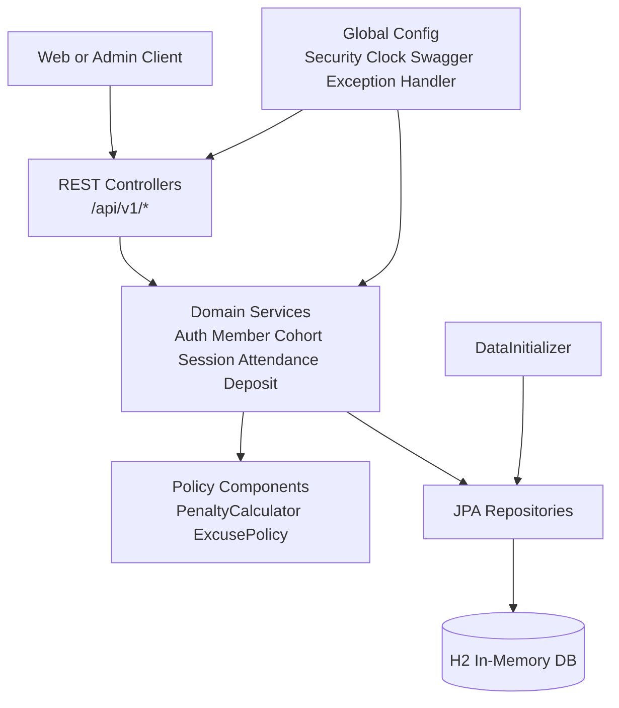
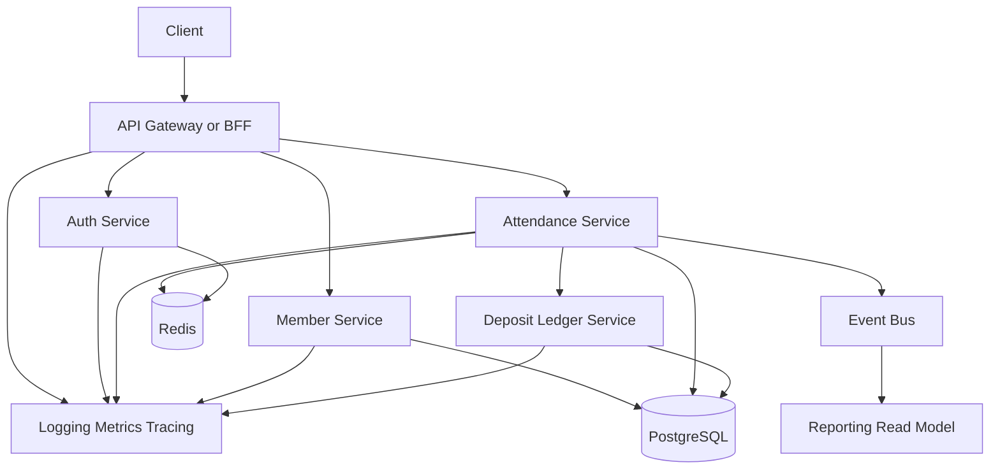

# System Architecture

## Current Architecture

## Ideal Next Architecture

## Notes

- H2 인메모리 DB 사용 — 과제용이라 외부 DB 연결 없음
- 현재 기수는 `app.current-cohort-number` 설정으로 관리
- 패널티 차감과 보증금 변동은 서비스 레이어에서 처리
- 실서비스라면 PostgreSQL, Redis, 이벤트 버스 구조로 전환 필요
