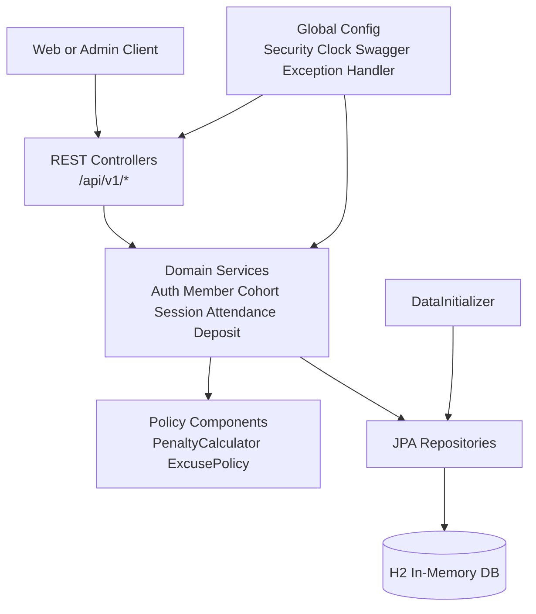
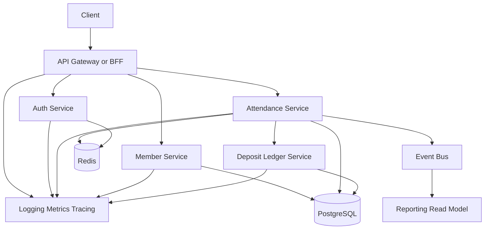

# System Architecture

## Current Architecture

## Ideal Next Architecture

## Notes

- 현재 구현은 과제 범위에 맞춰 단일 Spring Boot 애플리케이션으로 구성했다.
- 현재 기수는 `app.current-cohort-number` 설정으로 분리했다.
- 출결 패널티와 보증금 변동은 서비스 레이어에서 일관되게 처리한다.
